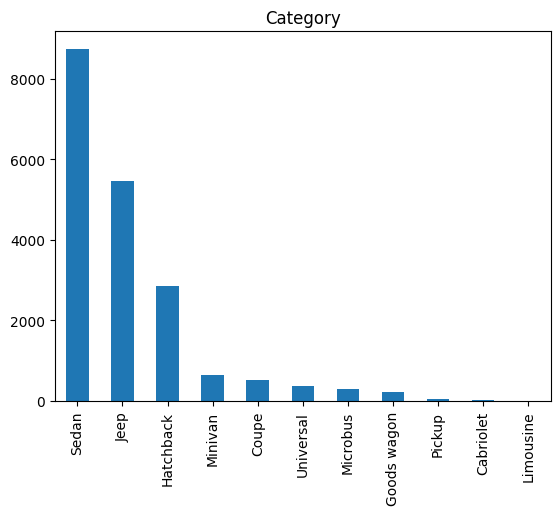
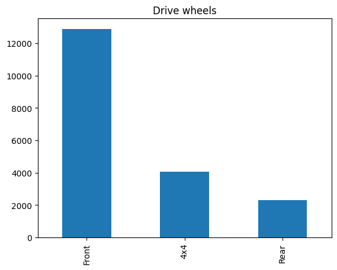
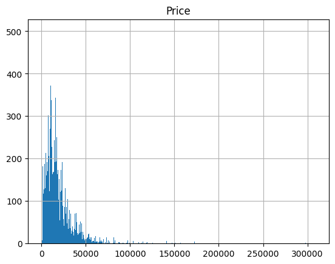


`                                                               `

Data Science Course Project

Team 4

Team members:-

|Name|Sec|BN|
| :-: | :-: | :-: |
|Robert Mounir|1|31|
|Bishoy Atef|1|22|
|Mohamed Ahmed|2|11|
|Nour eldin Mostafa|2|33|

Outline

- Idea
- Problem
- Dataset
- Data preparation
- Data description/exploration
- Building models & Interpreting the results
- Testing
- Team contribution

Idea

AutoPricing: Navigating the American Car Market with Data

As a new car brand, we are planning to introduce our latest car model in the market. However, we are currently in the process of determining the optimal pricing strategy for maximizing profitability.

Problem

When deciding on pricing for our new car brand, we must take into account the product features and quality that customers value and are willing to pay a premium for. It's crucial to consider these factors as they can impact our pricing strategy significantly. As a new brand, we should be particularly mindful of how we price our models in relation to our competitors while also keeping in mind the value that our products offer to potential customers.

**Dataset**

As the automobile industry continues to produce a wider range of vehicles with unique capabilities and attributes, such as make, year, category, brand, fuel type, engine volume, mileage, number of cylinders, color, airbags, and more, consumers are increasingly seeking to purchase a vehicle that meets their specific needs while remaining within their budget. In an effort to address this pricing challenge, we have compiled a training dataset of 19,237 records that includes various car features for analysis from Kaggle.

Link: <https://www.kaggle.com/datasets/sidharth178/car-prices-dataset?select=train.csv>

Data preparation

1. Pre-processing:
   1. For Levy column, I had to remove “ - “ that was found in the csv as it indicates wrong answer
   1. For Engine volume, I had to remove turbo that is found in the column to ensure it is float column, and add column named “turbo” with value True, False 
   1. Remove space found in engine volume
1. Organisation & Cleaning:
   1. Drop columns Doors, Color,Wheel as we don’t use them

1. Visualisation:

Data description/exploration

1. **What is the distribution of car prices in the dataset?**
   1. Link to full-size image: <https://public.tableau.com/app/profile/bishoy.atef/viz/BookMain_16830577073760/MainStory?publish=yes>
   1. Most car prices range from less than 7,000 till 22,000 which are mid range cars.

1. What is the most common car brand in the dataset?

We can see that prius is the most common car brand with 1083 count

1. **What is the relationship between car price and its other features such as Fuel type, cylinders count, turbo engine?**
   1. Link to full images: <https://public.tableau.com/app/profile/bishoy.atef/viz/BookMain_16830577073760/MainStory?publish=yes>
   1. Fuel type: most cars regardless of their price use petrol especially expensive cars use petrol because of the powerful engines thay posses. Link: <https://public.tableau.com/app/profile/bishoy.atef/viz/BookMain_16830577073760/MainStory?publish=yes>
   1. Cylinder count: 4 is a popular number in the low and midrange category while 6,8, and 12 are dominant in more expensive cars.

1. Turbo engine: low and midrange cars do not have turbo engines while most of the expensive cars have, link: <https://public.tableau.com/app/profile/bishoy.atef/viz/BookMain_16830577073760/MainStory?publish=yes>

1. **Can we predict the price of a car based on mileage?**
   1. The graph shown below illustrates that we can do that in low and midrange cars but in more expensive cars the relationship does not hold.

1. **What is the relationship between car prices and the year of manufacture?**
   1. Car prices increase almost exponentially with the year of production

1. **Can we predict the engine volume of a car based on its features?**
   1. We conclude that we can't predict the engine volume based on its features, as we can see that the different engines Volume has many solutions, so it will be hard to find the correct engine volume using these features.

1. **Can we predict the levy of a car based on its features?**
   1. We can find that the levy is found to be more dense with more production years, and from the table between the levy and manufacturer, we can see that there is a probability for some manufacturer to give more levy than other manufacturers.
   1. You can see the full image here <https://public.tableau.com/shared/6FY8J4K4Q?:display_count=n&:origin=viz_share_link>

1. **Does the relationship between car prices and the fuel type differ between cars with different production years, and if so, how?**
   1. Yes, as we came closer to the highest price, we could see that it was only found in the latest production years (between 2010 and 2021) and we can see that it is found in the petrol fuel type as we come closer to the highest price
   1. **You can see the full image here: [https://public.tableau.com/views/DSDashboard_16828862617510/Sheet4?:language=en-US&:display_count=n&:origin=viz_share_link**](https://public.tableau.com/views/DSDashboard_16828862617510/Sheet4?:language=en-US&:display_count=n&:origin=viz_share_link)**

1. **Is there a relation between the number of airbags in a car and the production year of the car?**
   1. Yes, there is a relationship between the number of airbags in a car and other car features such as fuel type and production. As we can see, the only hydrogen car has only 8 airbags, and the probability of it being a gasoline car is greater than the other, as I had used the density to express the count of cars that are in this interval.
   1. You can see the full image here : <https://public.tableau.com/views/DSDashboard_16828862617510/Sheet3?:language=en-US&:display_count=n&:origin=viz_share_link>

1. **What is the distribution of manufacturers in the dataset?**
   1. HYUNDAI and TOYOTA are the most dominant at 3700 and 3600 respectively.

1. **What is the relationship between the car category and engine volume?**
   1. We can find that there are some categories that are found in specific engine volumes and drive wheels, and there are some categories that are found in specific gear box types but not in the others.
   1. You can see full image here <https://public.tableau.com/shared/8YQYWHMS5?:display_count=n&:origin=viz_share_link>

**Building models & Interpreting the results.**

1. **The correlation between car prices and the number of cylinders in the engine**
   1. The correlation between Cylinders and Price is:  0.15600840175540825
   1. The correlation is positive, but not very strong. This means that the number of cylinders in the engine has a weak impact on the price of the car.

1. ` `**The correlation between car prices and the mileage**
   1. The correlation between Mileage and Price is:  -0.03485695421138315 
   1. The correlation is negative and relatively strong. This means that the mileage of the car has a strong impact on the price of the car.

1. **The correlation between car prices and the year of manufacture**
   1. The correlation between Prod. year and Price is:  0.3286631210183748
   1. The correlation is positive and relatively strong. This means that the year of manufacture of the car has a strong impact on the price of the car

1. ` `**Difference in car prices between cars with different numbers of cylinders in the engine**

|No. Cylinders|16|14|12|10|8|7|6|5|4|3|2|1|
| :-: | :-: | :-: | :-: | :-: | :-: | :-: | :-: | :-: | :-: | :-: | :-: | :-: |
|Mean Price|17519|15681|40896|31561|31782|12058|19276|15630|17930|9957|11302|17317|
|Median Price|11604|15681|27754|38103|25089|11259|13000|14113|14167|8467|10243|9722|

- Bar plot between Number of cylinders and the mean price

`								`		

- Conclusion: There is a significant difference in car prices between cars with different numbers of cylinders in the engine.

1. ` `**Prediction of the price of a car based on its features**

1. We used RandomForestRegressor with n\_estimators=100 after converting prices to log scale.
1. Evaluation:
   1. MSE: 0.20
   1. RMSE: 0.44
   1. Accuracy:  0.7235767238565514
   1. prediction is possible but not very accurate.

1. **Prediction of the engine volume of a car based on its features**

1. We used RandomForestRegressor:
   1. n\_estimators=100 to predict the engine volume. 
1. Evaluation:
   1. MSE: 0.08
   1. RMSE: 0.28
   1. Accuracy:  0.8940905680450747
   1. prediction is possible with good accuracy.

1. **Prediction of the levy of a car based on its features**

1. We used RandomForestRegressor with n\_estimators=100 to predict the engine volume. 
1. Evaluation:
   1. MSE: 0.03
   1. RMSE: 0.17
   1. Accuracy:  0.7772434533874942
   1. The prediction is possible but not very accurate.

1. **The relationship between car prices and the mileage of the car Differences between cars with different fuel types, and how the relation holds** 

1. Scatter plot shows the relationship between car prices and the mileage of the car with different fuel types.
1. Conclusion: yes, the relationship between car prices and the mileage of the car differs between cars with different fuel types.
1. For example, the relationship between car prices and the mileage of the car is negative for diesel cars, but positive for electric cars this because diesel cars are more expensive than electric cars, so the more mileage a diesel car has, the lower the price will be the diesel and petrol cars have a similar relationship between car prices and the mileage of the car (negative) because there engine more prone to damage with higher mileage

1. ` `**The relationship between car prices and the Manufacturer of the car Differences between cars with different production years, and how the relation holds** 

1. The plot shows the relationship between car prices and the Manufacturer of the car with different production years.
1. Conclusion: No, the relationship between car prices and the Manufacturer of the car does not differ between cars with different production years
1. The relationship between car prices and the Manufacturer of the car is positive for all production years this is because the more expensive cars are produced by the more expensive 
1. manufacturers (BMW, Mercedes-Benz, Toyota, Volkswagen, Audi) and by years the price of the cars increases because of inflation and the increase in technology and quality of the cars

1. **The relationship between car prices and the fuel type Differences  between cars with different production years and how the relation holds** 

1. The plot shows the relationship between car prices and the fuel type of the car with different production years.

1. Conclusion: The relationship between car prices and the fuel type differs between cars with different production years before 2000, the relationship between car prices and the fuel type is positive for all fuel types this is because before 2000, the only fuel types available were diesel and petrol, and diesel cars were more expensive than petrol cars after 2000, the relationship between car prices and the fuel type is negative for diesel cars and positive for petrol cars this is because after 2000, the electric cars were introduced, and they were more expensive than diesel cars.

1. **The Correlation between the number of airbags in a car and the production year of the car**
   1. Correlation between the number of airbags in a car and the production year of the car:  0.23696931505274932
   1. The plots show the relationship between the number of airbags in a car and the production year of the car.
   1. Conclusion: Yes, there is a relation between the number of airbags in a car and the production year of the car.
   1. The correlation between the number of airbags in a car and the production year of the car is positive and slightly strong. This is because the number of airbags in a car increases with the increase in technology and quality of the cars.
   1. This is also because the number of airbags in a car increases with the increase in the safety of the cars which it is important for the customers

1. ` `**The relationship between the car category and engine volume**
   1. The plot shows the relationship between the car category and the engine volume.
   1. Conclusion: The plot shows that the engine volume of the cars in the category of "Jeep", "limousine" is the highest, and the engine volume of the cars in the category of "sedan", "hatchback" etc. is the lowest.
   1. Reason is that the cars in the category of "Jeep", "limousine" are bigger than the cars in the category of "sedan", "hatchback" etc. so they need bigger engines to move and more power to accelerate.

**Testing**

1- test whether the average price of Mercedes-Benz cars in the dataset is significantly different from a given value.

- Null hypothesis: The average price of Mercedes cars is equal to or greater than $20,000.
- Alternative hypothesis: The average price of Mercedes cars is less than $20,000.
- Significance level: Let's use α = 0.05 (or 5%).	

Fail to reject the null hypothesis. The average price of Mercedes cars is equal to or greater than $20,000.

2- Test whether the average price of cars with leather interiors is higher than the average price of cars without leather interiors.

- Null hypothesis: The average price of cars with leather interiors is greater than or equal the average price of cars without leather interiors(claim).
- ` `Alternative hypothesis: The average price of cars with leather interiors is less than the average price of cars without leather interiors.
- Statistical test: One-tailed t-test for independent samples.

The average price of cars with leather interiors is significantly higher than the average price of cars without leather interiors.

3- Test whether the average price of cars with diesel engines is significantly different from the average price of cars with petrol engines.

- Null hypothesis: The average price of cars with diesel engines is equal to the average price of cars with petrol engines.
- Alternative hypothesis: The average price of cars with diesel engines is significantly different from the average price of cars with petrol engines.
- Statistical test: Two-tailed t-test for independent samples.

Reject null hypothesis. The average price of diesel cars is significantly different from the average price of petrol cars.

4- 

- Null hypothesis: there is no association between the manufacturer and the car category. 
- Alternative Hypothesis:  there is an association between the manufacturer and the car category.
- Statistical test: Chi-Square Goodness of Fit Test.

Reject Null hypothesis.

**Team Contribution**

- Data preparation:
  - Bishoy Atef
  - Mohamed Ahmed
- Data description/exploration:
  - Bishoy Atef
  - Mohamed Ahmed
- Building models & Interpreting the results:
  - Robert Mounir
- Testing:
  - Nour eldin Mostafa
